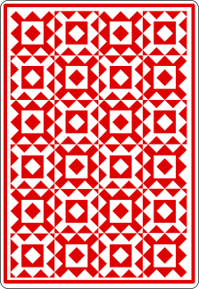

# Blackjack
Welcome to my open ReadMe Blackjack game where anyone who visits my GitHub profile can play :)! This is inspired by @marcizhu's [ReadMe Chess](https://github.com/marcizhu/marcizhu/tree/master).

## Game Rules
Blackjack, or 21, is one of the most popular casino card games. In Blackjack, everyone plays against the dealer. Players receive all cards face up, while the dealer’s first card is face up and the second is face down. Players aim to reach a score of 21 without exceeding it before the dealer hits 17. You win if you don’t bust and your total is higher than the dealer's cards. If a hand goes over 21, it is called a "bust" or "break."

### Card Values:
- Jacks, Queens, Kings, and 10s count as 10.
- An Ace may be played as 1 or 11.
- All other cards are played at face value.

## How to Play
When you receive your first two cards, you have two main options:
- **Stand**: If you feel your total is close enough to 21, you can choose to stand, meaning you do not wish to receive any additional cards.

- **Hit**: If you wish to receive another card, you can choose to hit. You may draw as many cards as you want until you are close to 21 or until you bust.

Enjoy the game and good luck!

## Dealer's Hand
 

## Player's Hand
 

## 

Last 5 moves in this game

<!-- BEGIN LAST MOVES -->

| Move | Author |
| :--: | :----- |
| `E5` to `F4` | [ @huuquyet](https://github.com/huuquyet) |
| `C1` to `F4` | [ @lucifer10042003](https://github.com/lucifer10042003) |
| `F8` to `D6` | [ @huuquyet](https://github.com/huuquyet) |
| `D5` to `D6` | [ @lulunac27a](https://github.com/lulunac27a) |
| `E6` to `E5` | [ @rezaisajjad](https://github.com/rezaisajjad) |

<!-- END LAST MOVES -->

  
Top 10 most moves across all games

  <!-- BEGIN TOP MOVES -->

| Total moves |  User  |
| :---------: | :----- |
| 692 | [@JohnyP36](https://github.com/JohnyP36) |
| 364 | [@marcizhu](https://github.com/marcizhu) |
| 358 | [@mishmanners](https://github.com/mishmanners) |
| 196 | [@KubaRocks](https://github.com/KubaRocks) |
| 116 | [@the1Riddle](https://github.com/the1Riddle) |
| 109 | [@viktoriussuwandi](https://github.com/viktoriussuwandi) |
| 68 | [@N-NeelPatel](https://github.com/N-NeelPatel) |
| 65 | [@lulunac27a](https://github.com/lulunac27a) |
| 62 | [@herndev](https://github.com/herndev) |
| 62 | [@1TusharSharma1](https://github.com/1TusharSharma1) |

<!-- END TOP MOVES -->

